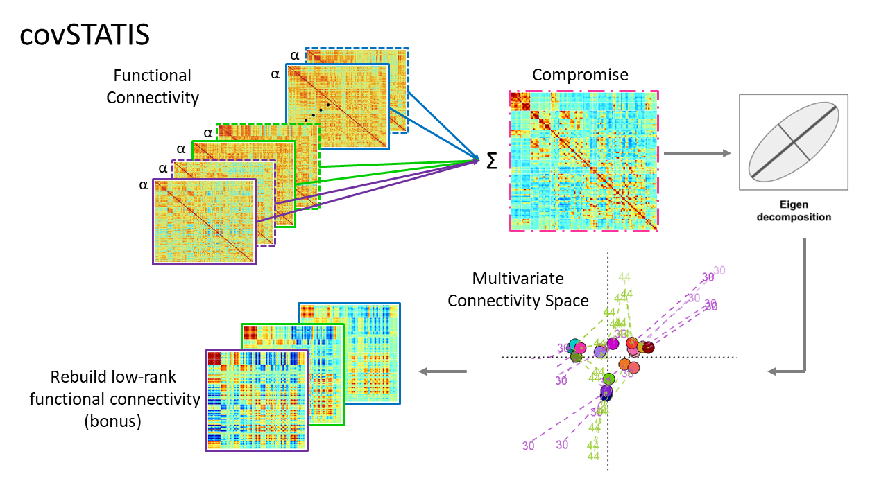
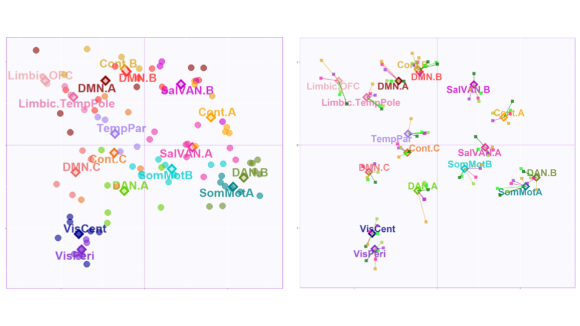
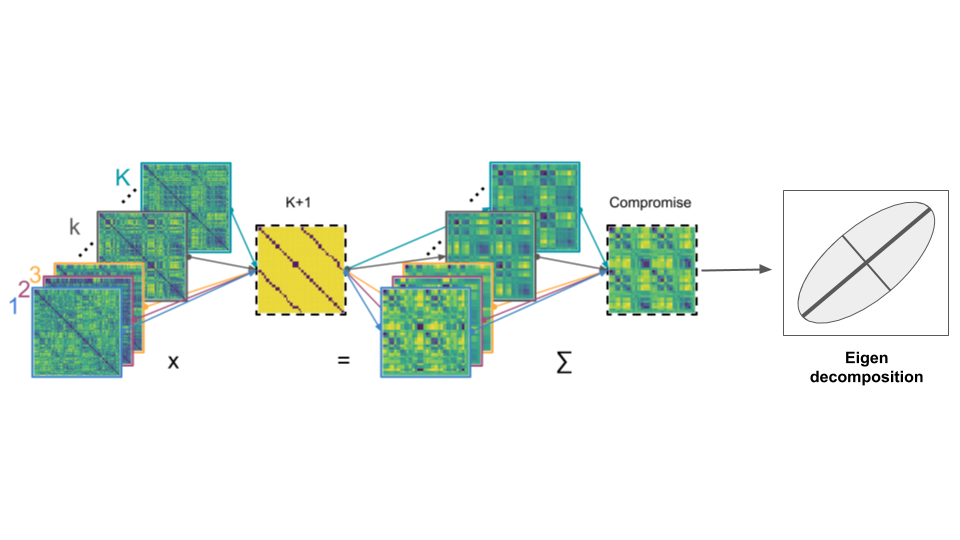
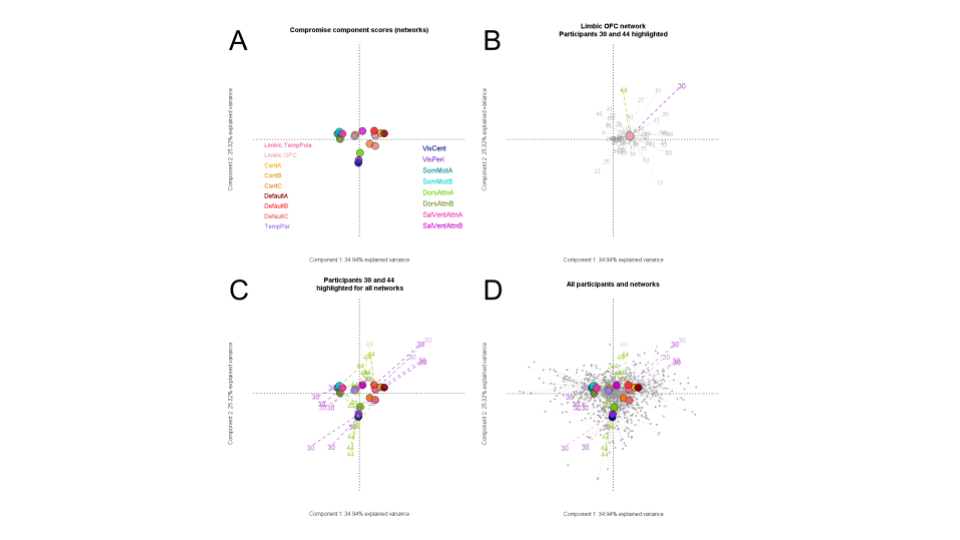

C-MARINeR
================

C-MARINeR
=========

C-MARINeR is a focused sub-project MARINeR: *M*ultivariate *A*nalysis and *R*esampling *I*nference for *Ne*uroimaging in *R*. The "C" stands generally for connectivity, but specifically (and statistically) covariance or correlation. C-MARINeR was also initially planned as a third phase (A, B, C) in MARINeR that addresses one table (A), two table (B), and multi-table (C) analyses for neuroimaging data.

At its core, the C-MARINeR project uses a particular statistical technique called CovSTATIS, which standards for "Covariance STATIS". STATIS is an acronym in French that roughly translates to “structuring three way statistical tables”.

General outline and goals
=========================

This project has been underway through separate works on connectivity by the repository maintainers (Jenny & Derek). We are bringing these projects together under a single project now, with milestones that align with BrainHackTO:2019 and OHBM's BrainHack in Rome (hopefully!). We will provide status updates, project progress, and ultimately a fully functional ShinyApp with examples going forward.

Our primary goal is to make a small package and ShinyApp to perform the same types of analyses we use for integrating and analyzing multiple connectivity matrices (across tasks, invididuals, and groups). We want to make CovSTATIS and similar methods easily accesible.

An overview of CovSTATIS & K+1CovSTATIS
=======================================

CovSTATIS is the base method that allows for multiple connectivity (correlation or more generally covariance) matrices to be integrated into a single analysis.

CovSTATIS produces component (a.k.a. factor) maps with respect to the compromise matrix (weighted average), and then projects each inividual matrix back onto the components. CovSTATIS can be seen at OHBM in the poster titled "Reconfiguration of functional networks during cognitive control across the adult lifespan" (day, time, and poster number TBD).

K+1CovSTATIS is a novel extension of CovSTATIS that allows us to use a "target" or reference matrix. For example, a theoretical resting state structure (a la Yeo/Schaffer maps).

K+1CovSTATIS also produces component (a.k.a. factor) maps with respect to the compromise matrix (weighted average), except the compromise matrix is no longer a weighted average of all matrices, rather, it is a weighted average of all matrices with respect to a "target" matrix. Then each of those matrices are projected back onto the components.

K+1CovSTATIS can be seen at OHBM in the poster titled "Individual and group-level multivariate resting state fMRI profiles in vascular cognitive impairment" (day, time, and poster number TBD).

Directory structure
===================

We provide an outline of the directory structure here.
